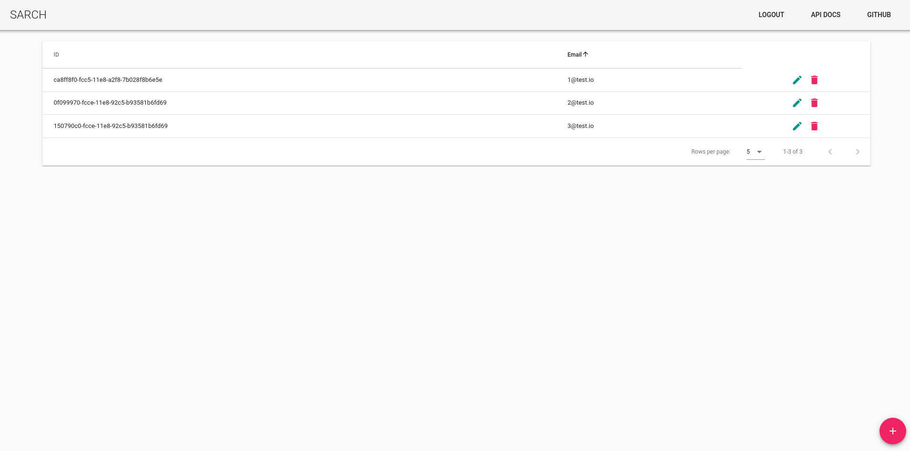
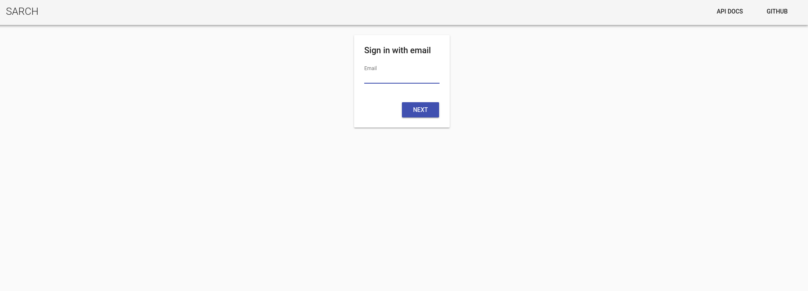

# SARCH

SARCH is a simple REST API built with node. It has integrated CircleCI with Heroku.



### Functionalities

SARCH exposes a simple REST API for **Accounts**.

Accounts objects have two fields:

```
{
    id: string // autogenerated
    email: string // a valid email
}
```

For more API docs check this [link](https://sarch-io.herokuapp.com/api/v1/docs/).

You can perform CRUD operations with the client APP with this [Demo](https://sarch-io.herokuapp.com/)

### Prerequisites

Before any step please make sure you have the following packages on your machine:

- Git
- Node
- Yarn
- Vue CLI 3 (see installation tutorial [here](https://cli.vuejs.org/guide/installation.html))

You also need a **Firebase Account** to make use of Realtime DB for this project. See this [link](https://firebase.google.com/docs/database/) for more info.

Heroku and CircleCI are optional.

### Folder structure

```
+-- .circleci -- Circle CI configs
+-- client -- A Vue 2 client generated with Vue-cli@3
+-- config -- Server config files
+-- public -- build deployment from client sub project
+-- scripts -- all build&deployments scripts
+-- src -- Service source
|   +-- api -- all the service endpoints
|   +-- business -- the business layer
|   +-- components -- logging components, audit, etc
|   +-- config -- configuration middlewares
|   +-- data -- data layer
|   |   +-- repositories // all repositories needed for api/models
```

### Tech Stack

Service

- [Typescript](https://www.typescriptlang.org/)
- [Nodemon](https://nodemon.io/)
- [Jest](https://jestjs.io/)
- [Supertest](https://github.com/visionmedia/supertest): for testing the Server APP

- [Express](https://expressjs.com/)
- [express-rate-limit](https://www.npmjs.com/package/express-rate-limit): used to config rate limits for our API
- [body-parser](https://www.npmjs.com/package/body-parser)
- [Firebase Admin](https://www.npmjs.com/package/firebase-admin): this package will help us to manage our Realtime DB and to authenticate user tokens
- [helmet](https://github.com/helmetjs/helmet): for basic security config
- [winston](https://github.com/winstonjs/winston), [morgan](https://www.npmjs.com/package/morgan): We will use both to handle logs for the service
- [swagger](https://swagger.io/docs/specification/2-0/basic-structure/): for OpenAPI definitions
- [redoc-cli](https://github.com/Rebilly/ReDoc): For auto generate docs from swagger.json
- [Config](https://www.npmjs.com/package/config): to handle configuration files in different environments
- [UUID](https://www.npmjs.com/package/uuid): to generate UUID with V1 functions
- [ShellJS](https://github.com/shelljs/shelljs): For building process

Client

- JavaScript ES6

- [Vue 2](https://vuejs.org/)
- [Vuetify](https://vuetifyjs.com/en/)
- [Axios](https://github.com/axios/axios): For all the API requests
- Firebase App, Firebase Auth: We are using Firebase Auth to authenticate our users. The client project uses the CDN scripts. See more [here](https://firebase.google.com/docs/web/setup).

### Before start

- You have installed Vue CLI 3 globally. Check vue cli version with `vue --version` // output: 3.x

- You have enabled Realtime DB on your Firebase Project
- You have enabled users authentication with sign-in method "Email/Password". More [here](https://firebase.google.com/docs/auth/web/firebaseui)

### Installation

First clone this repo

```
git clone https://github.com/ioprotium/sarch
```

Install dependencies in project root folder

```bash
yarn install
```

**Note:** Once the installation has finished a **postinstall** script will run. This script will build the service in order to get **CircleCI** and **Heroku** working.

Install client dependencies

```
cd client && yarn install
```

### Building

First check you are in the project root folder and then run

```
yarn build:local
```

The build script will execute the following operations

- Clean prev build by removing **/dist and /public** folder
- Build Service
- Generate API docs with **redoc-cli** and copy to **dist/api/docs/index.html**
- Build Client and copy **/client/dist** into **/public**

Build Scripts

- `build:client`
- `build:service`
- `build:local`
- `build`: this scripts is used for **CircleCI** and **Heroku**. It only builds the service and generate the API docs, the public folder published in this repo.

### Configuring Firebase Credentials

Before running the app you need to configure your Firebase credentials. Follow this [steps](https://firebase.google.com/docs/admin/setup) to get your credentials.

Now you need to create **/config/prod.yml** and **/config/dev.yml**. Both files must be populated with this content

```yaml
firebase:
  projectId: <PROJECT_ID>
  baseUrl: https://<DB NAME>.firebaseio.com
```

Now you need to export your **clientEmail** and **privateKey** as environment variables.

If you are on a Linux based OS you can execute the following commands in the console

```bash
export FIREBASE_EMAIL_CLIENT=<email client>
export FIREBASE_PRIVATE_KEY="<private key>"
```

**NOTE:** The **FIREBASE_PRIVATE_KEY** must be double quoted or you will get an error running the app. This is because the private key contains line breaks.

Check your environment variables

```
echo $FIREBASE_EMAIL_CLIENT && echo $FIREBASE_PRIVATE_KEY
```

### Running

Check **/dist and /public** folder were generated correctly and then execute in project root folder

```
yarn start
```

Now navigate to [http://localhost:3000](http://localhost:3000). It must show the sign-in dialog



Once you log in with a valid email account you will see the accounts table empty. If you add an account firebase will create a DB called **accounts** in your firebase project.

**If you had any error please submit a issue.**

### Development

For **service** development just run in project root folder

```
yarn dev
```

Nodemon is configured to work with **ts-node** for watch&reload the service. Any change you make in source files will trigger a reload. **Note:** server PORT number is configured in **/config/default.yml**

For client development you have to configure your firebase app. Open **/client/.env.development** and add your config. To get your firebase public key go to [https://firebase.google.com/docs/web/setup](https://firebase.google.com/docs/web/setup)

Now run

```
cd client && yarn serve
```

This will use Vue cli for live and hot reload on port **8080**.

**Note:** Due to hot reload features is possibly that you will experiment errors with firebase app instance. If you see errors in web inspector just hit F5.

**Note:** if you had changed the default server port (**3000**) you must change **VUE_APP_ROOT_API** in **/client/.env** file.

### Testing: Jest

Tests are written with [BDD pattern](https://en.wikipedia.org/wiki/Behavior-driven_development). This project uses **Jest** and **ts-jest** to run test from our source files. Jest patterns is set to match **specs.ts** and **\*.scpecs.ts** files. There will be a specs file defined for each API endpoint. Also we have a specs file defined for server responses tests.

To execute tests run

```
yarn test
```

**Note:** When you are running test the API will use a MockRepository to simulate DB operations.
**Note:** The authentication check is disabled in **dev** and **test** environment (**process.env.NODE_ENV**)

### Testing: CURL or Postman

First run the server in **dev** mode to disable AUTH check.

If you want to test the auth layer run the service in **prod** mode

```
yarn start
```

Check if auth layer is working

```
curl -X GET http://localhost:3000/api/v1/accounts
```

You will get an 401 because the X-Access-Token was not provided


**Note:** you can extract your **TOKEN KEY** using web inspector network panel to monitor client app requests to the server

### SARCH is production ready?

No. SARCH was made to be as simple as possible. I didn't put much effort on the client and the authentication is addressed by Firebase SDK. For this app to be production ready we should:

- **Real Time Updates:** As we are making use of Firebase Realtime DB we should take advantage of the SDK to provide real time data updates on the client.
- **Audit security:** SARCH uses **helmet** default config and rate limit is set at 100 request per every 5 minutes. We should check and research for all the security threats for our current tech stack before deploy it to production environments.
- **Check users accounts:** The firebase auth is configured to accept users with only an email and password. We should check if those users verified their accounts in order to grant access to them. We should change the auth support to another providers like Google, Facebook or Twitter. That could work as another security layer forcing users to get a valid account in other platforms. We could also add a catpcha to the login view.
- **Service Logs:** we should check all possible unhandled exceptions in the node process as we add more endpoints to our API. The logs are defined as TAG based. Each log message must provide a context and all the info needed for debugging.
- **Detach Client APP:** Client app should be placed in other project and this project should only serve the API resources. The build script should only care about the service. To keep things simple the client app is a subproject.
- **Strategy Pattern for DB providers:** This project was developed to use **Firebase Realtime DB** but we should add one more layer to allow us to change the DB provider if it is needed.
- **Reducing server load and response time:** we should apply compression on the responses. We should also apply conditional and cache headers.
- **Implement GraphQL over Firebase Realtime DB or other db providers implemented:** as our API model grows we could implement GraphQL.
- **Implement Git Flow:** SARCH uses only a **development** branch. I did this entire project alone so I worked only on development. We should implement git flow for feature/release development and configure Git to merge **development** branch on **master** only if test are passed.
- **Docker:** this project has an initial Docker config but no image was build. Getting a container for our app could help us to make deployment in many cloud services that supports docker images.
- **Improve Service Oriented Architecture Development**: To improve the development experience of this project we could implement a framework to help us with the architecture and OpenApi definitions. [Tsoa](https://github.com/lukeautry/tsoa) looks promising.

### MISC

To configure and CircleCI you only have to get a free CircleCI account and fork this project. Same for Heroku deployments.

**Note:** you will have to configure the needed environment variables in both services.

### Suggestions?

Feel free to send a PR

### LICENSE

[MIT](LICENSE)

© Brian Mayo - 2018
